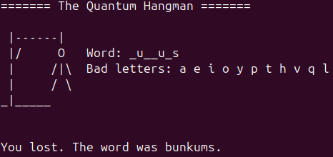

# The Quantum Hangman
Another quantum game

 

The program needs a file *dict.txt* that contains a dictionnary, one word per line.

## How to use

- Install OCaml
- Compile the program using **make**
- Execute *./hangman* 
- Then, you can try to guess the secret word by typing one letter at a time. Avast! You only have 10 tries before you lose!
- You can play with the help mode by executing *./hangman -h* if you are afraid

## How does it work?
There is no fixed secret word. Each time you type a letter, the program chooses the worst coherent option for you.